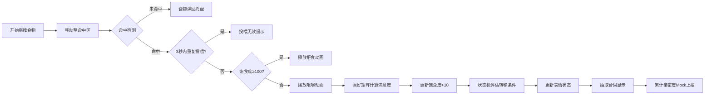

## 1. 产品概述

「投喂魅魔」是一款像素风休闲互动小游戏，玩家通过拖拽食物投喂魅魔角色，根据喜好矩阵结算满意度，驱动6种表情状态变化与台词气泡反馈。

- 核心玩法：拖拽食物至角色命中区，通过喜好表计算满意度，影响角色表情和台词
- 目标用户：休闲游戏玩家，二次元爱好者
- 产品价值：轻松治愈的互动体验，通过精细化的状态机和表情系统塑造角色性格

## 2. 核心功能

### 2.1 用户角色
| 角色 | 注册方式 | 核心权限 |
|------|----------|----------|
| 玩家 | 无需注册 | 拖拽投喂、查看状态、重置游戏 |

### 2.2 功能模块
1. **游戏主界面**：Canvas游戏区域、食物托盘、状态显示面板
2. **拖拽交互系统**：食物拖拽、命中检测、无效区域弹回
3. **表情状态机**：6种表情状态（开心、害羞、撒娇、委屈、困倦、兴奋）的表驱动状态转移
4. **满意度计算**：基于喜好矩阵（甜/咸/辣 × 心情）的满意度结算
5. **台词系统**：根据情感标签从 `lines.json` 抽取对应台词显示
6. **数据模拟上报**：满意度累计影响当日亲密度Mock上报

### 2.3 页面详情
| 页面名称 | 模块名称 | 功能描述 |
|----------|----------|----------|
| 游戏主界面 | Canvas渲染区 | 像素风魅魔角色绘制、表情动画、咀嚼动画、拒食动画 |
| 游戏主界面 | 食物托盘 | 显示3种口味食物（甜、咸、辣），支持拖拽 |
| 游戏主界面 | 状态面板 | 显示饱食度、满意度、连续投喂次数、当前心情 |
| 游戏主界面 | 台词气泡 | 根据当前表情和事件显示对应台词 |
| 游戏主界面 | 控制区 | 重置游戏按钮、关于信息 |

## 3. 核心流程

玩家从底部食物托盘拖拽食物 → 移动至魅魔命中区释放 → 命中检测 → 检查重复投喂冷却 → 检查饱食度 → 播放咀嚼动画 → 根据喜好矩阵计算满意度 → 状态机评估转移条件 → 更新表情状态 → 抽取并显示对应台词 → 累计满意度更新亲密度

## 4. 用户界面设计

### 4.1 设计风格
- **主色调**：深紫色 (#2d1b4e) 背景，粉红色 (#ff6b9d) 主色，淡黄色 (#ffd93d) 辅助色
- **像素风格**：8-bit 像素艺术，角色分辨率 64×64，使用像素字体
- **按钮风格**：像素化边框，悬停时轻微放大，点击时凹陷效果
- **字体**：Press Start 2P（像素字体）用于标题，M PLUS 1p 用于正文
- **布局风格**：居中Canvas游戏区，底部食物托盘，右侧状态面板
- **视觉细节**：扫描线滤镜、CRT屏幕效果、像素颗粒感

### 4.2 页面设计概述
| 页面名称 | 模块名称 | UI元素 |
|----------|----------|--------|
| 游戏主界面 | Canvas游戏区 | 640×480像素画布，魅魔角色居中，背景为像素化房间 |
| 游戏主界面 | 食物托盘 | 底部横向排列3种食物图标，每种带有口味标签 |
| 游戏主界面 | 状态面板 | 右侧垂直排列进度条（饱食度）、数值显示（满意度）、心情图标 |
| 游戏主界面 | 台词气泡 | 角色头顶的像素风气泡框，带有小三角指向角色 |
| 游戏主界面 | 控制区 | 右下角像素风格按钮 |

### 4.3 响应式
- 桌面端优先，Canvas固定尺寸640×480
- 移动端自适应缩放，触摸拖拽优化
- 最小支持宽度：360px

### 4.4 动画效果
- 角色呼吸动画：上下轻微浮动
- 咀嚼动画：嘴巴张合循环
- 表情切换：像素溶解过渡效果
- 拖拽反馈：食物半透明跟随，命中区高亮
- 饱食度满：角色摇头拒食动画
