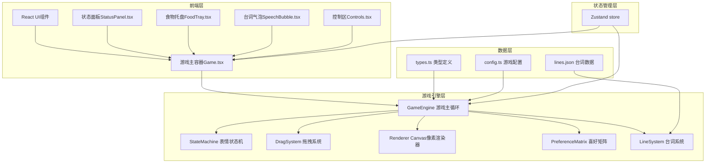

## 1. 架构设计



## 2. 技术描述
- **前端**：React@18 + TypeScript + Vite + TailwindCSS@3 + Zustand
- **初始化工具**：vite-init
- **渲染**：Canvas 2D API 实现像素风格渲染
- **状态机**：表驱动有限状态机（FSM）实现6种表情转移
- **拖拽**：原生HTML5 Drag and Drop API + Canvas命中检测
- **数据**：本地JSON存储台词，Mock数据模拟亲密度上报

## 3. 目录结构

```
src/
├── components/
│   ├── Game.tsx              # 游戏主容器
│   ├── StatusPanel.tsx       # 状态面板
│   ├── FoodTray.tsx          # 食物托盘
│   ├── SpeechBubble.tsx      # 台词气泡
│   └── Controls.tsx          # 控制区
├── game/
│   ├── GameEngine.ts         # 游戏引擎主循环
│   ├── StateMachine.ts       # 表驱动状态机
│   ├── DragSystem.ts         # 拖拽系统
│   ├── Renderer.ts           # Canvas渲染器
│   ├── PreferenceMatrix.ts   # 喜好矩阵
│   ├── LineSystem.ts         # 台词系统
│   └── pixelArt/             # 像素艺术数据
│       ├── characters.ts     # 角色像素数据
│       └── foods.ts          # 食物像素数据
├── store/
│   └── useGameStore.ts       # Zustand状态管理
├── types/
│   └── index.ts              # TypeScript类型定义
├── data/
│   ├── lines.json            # 台词数据
│   └── config.ts             # 游戏配置
├── utils/
│   └── mockApi.ts            # Mock上报API
├── App.tsx
├── main.tsx
└── index.css
```

## 4. 核心数据模型

### 4.1 类型定义

```typescript
// 口味类型
type Taste = 'sweet' | 'salty' | 'spicy';

// 表情状态
type ExpressionState = 'happy' | 'shy' | 'coquettish' | 'wronged' | 'sleepy' | 'excited';

// 心情类型
type Mood = 'normal' | 'good' | 'bad';

// 食物定义
interface Food {
  id: string;
  name: string;
  taste: Taste;
  pixelData: number[][];
}

// 游戏状态
interface GameState {
  satisfaction: number;        // 满意度 -100 ~ 100
  fullness: number;            // 饱食度 0 ~ 100
  consecutiveFeeds: number;    // 连续投喂次数
  currentMood: Mood;           // 当前心情
  currentExpression: ExpressionState;  // 当前表情
  lastFeedTime: Record<string, number>; // 各食物上次投喂时间
  idleTime: number;            // 空闲时间(秒)
  intimacy: number;            // 亲密度
}

// 状态转移条件
interface TransitionCondition {
  from: ExpressionState | '*';
  to: ExpressionState;
  condition: (state: GameState) => boolean;
  priority: number;
}
```

### 4.2 喜好矩阵

| 口味\心情 | normal | good | bad |
|----------|--------|------|-----|
| sweet    | +15    | +25  | +5  |
| salty    | +10    | +15  | -10 |
| spicy    | -15    | -5   | -20 |

## 5. 状态机转移表

| 优先级 | 起始状态 | 目标状态 | 转移条件 |
|--------|----------|----------|----------|
| 1 | * | excited | satisfaction ≥ 80 且 consecutiveFeeds ≥ 3 |
| 2 | * | happy | satisfaction ≥ 60 |
| 3 | * | coquettish | satisfaction ≥ 40 且 consecutiveFeeds ≥ 2 |
| 4 | * | shy | satisfaction ≥ 20 且 satisfaction < 40 |
| 5 | * | wronged | satisfaction < 0 |
| 6 | * | sleepy | idleTime ≥ 30 且 fullness ≥ 50 |
| 7 | * | happy | idleTime ≥ 60 |

## 6. 游戏配置常量

```typescript
// config.ts
export const CONFIG = {
  CANVAS_WIDTH: 640,
  CANVAS_HEIGHT: 480,
  PIXEL_SCALE: 2,
  FULLNESS_DECAY_RATE: 2,           // 每分钟衰减2点
  FULLNESS_PER_FEED: 10,            // 每次投喂+10饱食度
  MIN_SATISFACTION_CHANGE: -20,     // 单次满意度最小变化
  MAX_SATISFACTION_CHANGE: 30,      // 单次满意度最大变化
  EXPRESSION_MIN_DURATION: 2000,    // 表情最短维持2秒
  FEED_COOLDOWN: 3000,              // 重复投喂冷却3秒
  HITBOX_RADIUS: 80,                // 命中区半径
  MAX_FULLNESS: 100,
  MIN_FULLNESS: 0,
};
```

## 7. API定义（Mock）

```typescript
// 亲密度上报
interface IntimacyReportRequest {
  date: string;
  totalSatisfaction: number;
  feedCount: number;
}

interface IntimacyReportResponse {
  success: boolean;
  message: string;
  currentIntimacy: number;
}

// Mock API
async function reportIntimacy(data: IntimacyReportRequest): Promise<IntimacyReportResponse> {
  return new Promise(resolve => {
    setTimeout(() => {
      resolve({
        success: true,
        message: '上报成功',
        currentIntimacy: data.totalSatisfaction * 0.1,
      });
    }, 500);
  });
}
```
